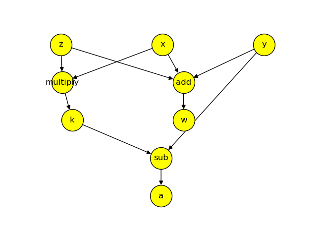
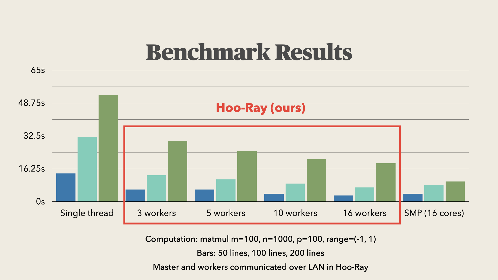

# Hoo-Ray

Meet Hoo-Ray: Ray-like distributed execution engine for Haskell, written in Haskell. Hoo-Ray uses an abstract syntax tree parser for parsing the data dependencies in the main function of a given Haskell program, and a greedy scheduler for scheduling all computations that have their dependencies met.

This project is done as part of the course [CS 512: Distributed Systems](https://courses.cs.duke.edu/spring23/compsci512/) at Duke University in Spring 2023.

# Quickstart

## Testing UDP multicast

If you want to use the tools for distributed computing, first make sure that UDP multicast works with your configuration.

To test UDP multicast, use `listener` and `sender` in the `c-test` folder like this:

```bash
# Terminal window 1
cd Server/c-test
make
./sender 239.255.255.250 1900

# Terminal window 2
cd Server/c-test
./listener 239.255.255.250 1900
```

If UDP multicast is configured properly[^udp], you should see *Hello, World!* printed on the terminal with `listener` running.

## Installation

- Install the Haskell toolchain, preferably via [GHCup](https://www.haskell.org/ghcup/).

- Run `cabal configure`. Optionally, If you want to build the tools for distributed computing, additionally pass in the argument `-f distributed` to this command (i.e. run `cabal configure -f distributed`).

- In this directory, run

    ```
    cabal install --only-dependencies
    ```

    to install the dependencies [^deps].


- Then, `cabal build` to build all the executables to make sure there are no critical errors.

- Finally, `cabal run [program] [args]` builds and runs the specified `program` with `args`. See *Hoo-Ray.cabal* for a current list of programs. For example, to generate the dependency graph for the file *Tests/pure1.hs*, one would do
    ```
    cabal run dependency-graph Tests/pure1.hs
    ```
    If you wish to use command flags, run `cabal run [program] -- [-f1|--flag1] ...` . For example, to generate matrix multiplication benchmark files, one could do
    ```
    cabal run matmul_test_gen -- -l 50 -m 100 -n 1000 -p 100 -r 10
    ```

- To run python code for visualization under the `Vis` folder, make sure to install all Python libraries in `requirements.txt`. They can be installed using:
    ```
    pip install -r requirements.txt
    ```

## Current Modules

##### dependency-graph

Generates a dependency graph (in text) from input file. e.g. `cabal run dependency-graph Tests/pure1.hs`

We also have a Python script using [NetworkX](https://networkx.org) and [PyGraphviz](https://pygraphviz.github.io) to visualize the graph. To run it, first install these two packages in your Python environment. Then redirect the output of the above command via e.g. `cabal run dependency-graph Tests/pure1.hs > Vis/graph.out`. Finally, modify the corresponding variables in `Vis/fetch_graph.py` and run `python Vis/fetch_graph.py`.

Output of `cabal run dependency-graph Tests/pure1.hs > Vis/graph.out` and `python Vis/fetch_graph.py` as an example:



##### distributed-compute

A simple example of a pair of master-slave server such that the master sends a job to a slave and the slave sends the job results back. All this logic is wrapped in the `Process ()` monad.

The parameters of this module are in the form `'master <host> <port>' or 'slave <host> <port>'`. To run this module, execute `cabal run distributed-compute slave 127.0.0.1 8081`. Then open another terminal and execute `cabal run distributed-compute master 127.0.0.1 8084`.

##### matmul_test_gen

Generates single-threaded (*Tests/matmul_ss_test.hs*), multi-threaded (*Tests/matmul_ms_test.hs*), and queue.hs compatible (*Tests/matmul_test.hs*) test files (when called with the `-t` flag) with matrix multiplication operations. For a detailed look at the configuration options, run

```
cabal run matmul_test_gen -- -h
```
To run the resulting multi-threaded test file, pass in the runtime flags like so:
```
cabal run matmul_ms_test -- +RTS -N
```

To time the execution of any program, use the `time` command (e.g. `time cabal run matmul_ms_test -- +RTS -N`).

#### queue

Runs the Hoo-Ray algorithm. More specifically, it generates the dependency graph for input test program in master and dispatches jobs to be remotely executed on slave workers.

The dependency graph is first reversed such that (A depends on B) => (there is an edge from B to A). Then the following two procedures are done concurrently on the master node

- *assignJobs*: Finds all the nodes with indegree 0 (computations that have all dependencies met) and assigns them to the slaves. When a job is dispatched, the master puts this node in a *visited* list such that this node is not sent again.
- *processReply*: Listens for response from the worker nodes. When a computation has sent back its result, the indegree of all the nodes that depend on this computation is decremented.

<!-- **TODO: add more details here to give a full description of the Hoo-Ray algorithm** -->

To start a remote slave worker, run 

```
cabal run queue slave <host> <port>
```

Then, to start the master, run 
```
cabal run queue master <host> <port>
```

**Remember to restart slave worker before starting the master worker (🍄 warning!)**

## Other modules

These are modules that did not withstand the test of time. Their service is no longer required, because their functionalities either got replaced or did not prove to be useful in the grand scheme of our projects. But we provide a description for what they do.

For instructions on how to run each module, try `cabal run module_name` first. If the module requires inputs, it should show a message about it.

##### arithmetic_test_gen

##### list_test_gen

The above two tests are too fast (usually takes <1 millisecond to execute the entire file) and the network overhead from distributing does not pay off.

##### distributed-example

While not used in production, this module can be used to identify whether the Haskell `distributed-process-simplelocalnet` package is working correctly.
- Run `cabal run distributed-example slave 127.0.0.1 8083` on one terminal.
- Then run `cabal run distributed-example master 127.0.0.1 8084`. You should see something like `Slaves: [nid://127.0.0.1:8083:0]` on this terminal[^localhost_problem].

# Developing

Add your file and its dependencies to `Hoo-Ray.cabal` just like the ones before.

[^udp]: In the particular case of misconfiguration that happened to me while running a Linux machine on Duke's network, I had to execute `sudo vim /etc/resolv.conf` and change the nameserver line to `nameserver 152.3.72.100`. Might not apply to you, but could be of interest to consult.
[^deps]: If you get an error about Cabal cannot resolve dependencies while installing with `-f distributed`, downgrade your GHC to 8.4.4 with `ghcup tui` and try again.
[^localhost_problem]: For some reason, using `localhost` here only occasionally works, but using `127.0.0.1` always works. Any networks person to explain why?


<!-- There is also a flag (-O) for GHC to compile everything aggressively optimized,  but that requires recompiling of all the existing libraries via `cabal install -p package --reinstall`-->


# Current benchmark results

<!-- Note: all benchmark results are wall clock times in secs, averaged over five runs. 
| Hardware Specs | Benchmark Parameters | Single-Thread Result | Multi-Thread Result |
| ----------- | ----------- | ----------- | ----------- | 
| 2021 MacBook Pro, 10-core M1 Max | -l 50 -m 100 -n 1000 -p 100 -r 1  | 15.290 | 3.259 |
| 2021 MacBook Pro, 10-core M1 Pro | -l 50 -m 100 -n 1000 -p 100 -r 1  | 14.893 | 3.472 |
| 2019 MacBook Pro, 8-core i9-9880H      | -l 50 -m 100 -n 1000 -p 100 -r 1  | 13.930 | 4.035 | -->

<!-- ## Experiments -->

All of the following tests are done on a 2019 MacBook Pro with i9-9880H (8 physical cores, 16 logical cores). The tests are generated via

```
cabal run matmul_test_gen -- -l {number_of_lines} -m 100 -n 1000 -p 100 -r 1 -t
```

The tests are run via one of

```
# Single thread
time cabal run matmul_ss_test
```

```
# Distributed parallel
cabal run queue master 127.0.0.1 8084
[keyboard interrupt]
python benchmark_servers.py {num_servers}
```

```
# Shared memory parallel
time cabal run matmul_ms_test -- +RTS -N
```

All time readings are rounded to the nearest decimal place since the timestamps in the distributed process package are only to the integral seconds.

|           | Single thread | 3 workers | 5 workers | 10 workers | 16 workers | SMP |
|-----------|---------------|-----------|-----------|------------|------------|--------------|
| 50 lines  | 14s           | 6s        | 6s        | 4s         | 3s         | 4s           |
| 100 lines | 32s           | 13s       | 11s       | 9s         | 7s         | 8s           |
| 200 lines | 53s           | 30s       | 25s       | 21s        | 19s        | 10s          |



