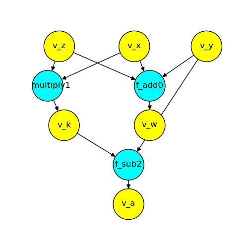

# Hoo-Ray
<p align="left">
  <a href="https://haskell.org/"></a>
  <a href="https://github.com/denx20/Hoo-Ray/blob/main/LICENSE"></a>
</p>

Meet *Hoo-Ray*: a distributed execution engine for Haskell, written in Haskell. The naming of *Hoo-Ray* came from our initial draft that this system would be similar to Ray, but in the end they are nothing alike.

Hoo-Ray uses an abstract syntax tree parser for parsing the data dependencies in the main function of a given Haskell program, and a greedy scheduler for scheduling all computations that have their dependencies met.

This project was done as part of the course [CS 512: Distributed Systems](https://courses.cs.duke.edu/spring23/compsci512/) at Duke University in Spring 2023.

## Installation

- Install the Haskell toolchain, preferably via [GHCup](https://www.haskell.org/ghcup/).
- `stack build` inside this directory

## Executable Modules

##### dependency-graph

Generates a dependency graph (in text) from input file and outputs to stdout. e.g. `stack exec build_graph test/matmul_ss_test.hs`

We also have a Python script using to visualize the graph. To run it,

```
# Follow the instructions for installing graphviz via
# https://pygraphviz.github.io/documentation/stable/install.html
# For example, my command is
brew install graphviz

# Install Python dependencies
pip install -r python-scripts/requirements.txt
```

Then redirect the output of the `build_graph` via e.g. `stack exec build_graph test/matmul_ss_test.hs > graph.out`. Finally, modify the corresponding variables in the top of `python-scripts/fetch_graph.py` and run `python python-scripts/fetch_graph.py` to get a png of the currently parsed computation graph.

Output of `stack exec dependency-graph Tests/pure.hs > graph.out` and `python fetch_graph.py` as an example:

<p align="center">
  
</p>

##### matmul_test_gen

Generates single-threaded (*Tests/matmul_ss_test.hs*), multi-threaded (*Tests/matmul_ms_test.hs*), and queue.hs compatible (*Tests/matmul_coarse_test.hs*, *Tests/matmul_fine_test.hs*) test files (when called with the `-t` flag) with matrix multiplication operations. For a detailed look at the configuration options, run

```
cabal run matmul_test_gen -- -h
```
To run the resulting multi-threaded test file, pass in the runtime flags like so:
```
cabal run matmul_ms_test -- +RTS -N
```

To time the execution of any program, use the `time` command (e.g. `time cabal run matmul_ms_test -- +RTS -N`).

#### queue

Runs the Hoo-Ray algorithm. More specifically, it generates the dependency graph for input test program in master and dispatches jobs to be remotely executed on slave workers.

The dependency graph is first reversed such that (A depends on B) => (there is an edge from B to A). Then the following two procedures are done concurrently on the master node

- *assignJobs*: Finds all the nodes with indegree 0 (computations that have all dependencies met) and assigns them to the slaves. When a job is dispatched, the master puts this node in a *visited* list such that this node is not sent again.
- *processReply*: Listens for response from the worker nodes. When a computation has sent back its result, the indegree of all the nodes that depend on this computation is decremented.

To start workers on the local server, run

```
# Start a single worker
stack exec queue slave 127.0.0.1 {port}

# Or start a number of them
./start.sh {number_of_workers}
```

Then, to start the master, run 
```
stack exec queue master 127.0.0.1 8000 {path/to/file/to/parallize.hs}
```

# Benchmarking

The tests are run via one of (the )

```
# Single thread
time stack exec {matmul_ss_test/mlp_example/transformer_example} 
```

```
# Distributed parallel
python benchmark_servers.py {num_workers}
```

```
# Shared memory parallel (we only wrote SMP for matmul_test)
time stack exec -- matmul_ms_test +RTS -N
```

# Troubleshooting

## Testing UDP multicast

The master and worker servers rely on UDP multicast provided by `distributed-process-simplelocalnet` to communicate. You can verify that UDP multicast is configured properly on your network by

```bash
# Terminal window 1
cd udp-test
make
./sender 239.255.255.250 1900

# Terminal window 2
cd udp-test
./listener 239.255.255.250 1900
```

If UDP multicast is configured properly[^udp], you should see *Hello, World!* printed on the terminal with `listener` running.

[^udp]: In the particular case of misconfiguration that happened to me while running a Linux machine on Duke's network, I had to execute `sudo vim /etc/resolv.conf` and change the nameserver line to `nameserver 152.3.72.100`. Might not apply to you, but could be of interest to consult.
[^deps]: If you get an error about Cabal cannot resolve dependencies while installing with `-f distributed`, downgrade your GHC to 8.4.4 with `ghcup tui` and try again. It seems that the distributed-process package has a dependency issue and can only work with GHC 8.x.x. Furthermore, we have tried using `stack` as our resolver, but it keeps falling back to stack with GHC 8.x.x even though the [distributed-process package](https://github.com/haskell-distributed/distributed-process) has some yaml files for GHC 9.x.x with stack. I am unsure why.
[^localhost_problem]: For some reason, using `localhost` here only occasionally works, but using `127.0.0.1` always works. Any networks person to explain why?

